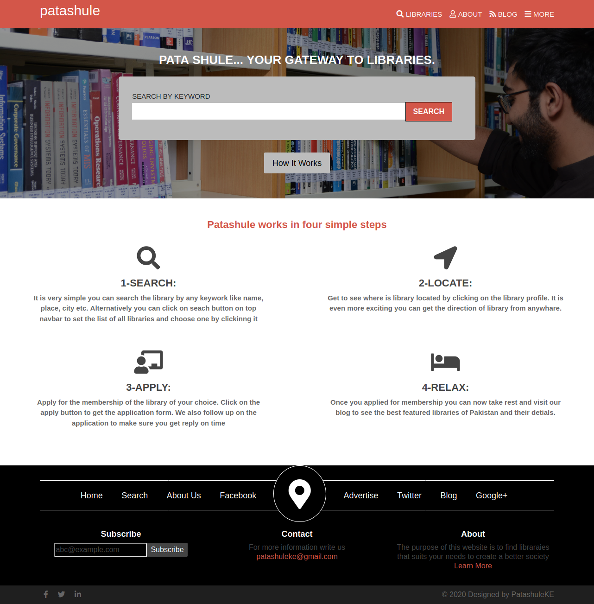
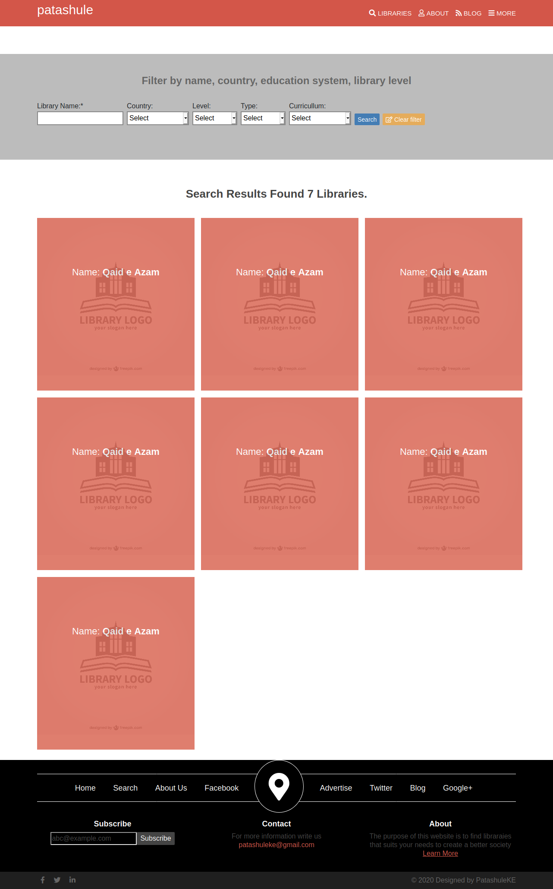
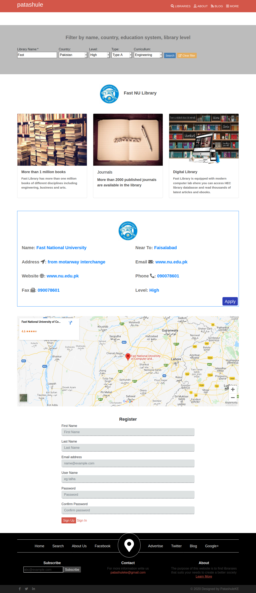
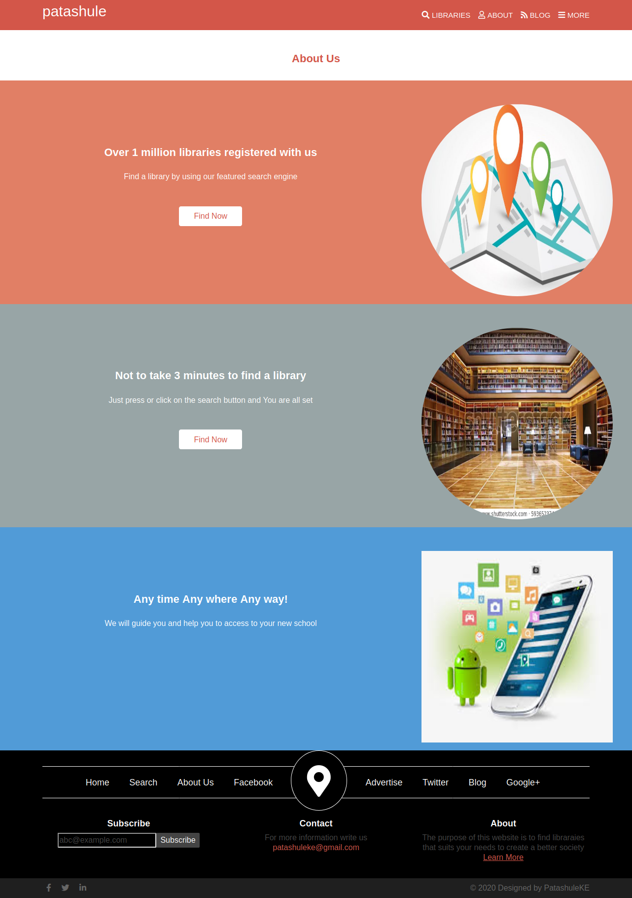

# Patashule Clone

This project is the HTML &amp; CSS Capstone Project which is based on an online directories of libraries. It resembles the real-life project.

## Project Design

### Home Page

Project Design Screenshot : 

### Search Page

Project Design Screenshot : 

### Detail Page

Project Design Screenshot : 

### About Page

Project Design Screenshot : 

This website uses Patashuale theme

## Built With

- Html,
- CSS,
- Bootstrap,
- Font Awsome for icons

## Live Demo

[Live Demo Link](https://talhawaqar.github.io/Patashule-Library/)

👤 **Author**

- Github: [@talhawaqar](https://github.com/talhawaqar)
- Linkedin: [@talha-waqar](https://www.linkedin.com/in/talha-waqar-977257145/)
- Twitter: [@MuhammadTalhaW4](https://twitter.com/MuhammadTalhaW4)
- email: (talhawaqar007@hotmail.com)
- email-2: (talhawaqar007@gmail.com)

## 🤝 Contributing

Contributions, issues and feature requests are welcome! Start by:

- Forking the project
- Cloning the project to your local machine
- `cd` into the Youtube-Replica project directory
- Run `git checkout -b your-branch-name`
- Make your contributions
- Push your branch up to your forked repository
- Open a Pull Request with a detailed description to the development branch of the original project for a review

## Show your support

Give a ⭐️ if you like this project!

## Acknowledgments

- Project originally taken from The Odin Project
- Project inspired by Microverse Program
- Thanks for this Website Design [PATASHULE](https://www.behance.net/gallery/25563385/PatashuleKE).

## 📝 License

This project is [MIT](https://opensource.org/licenses/MIT) licensed.
